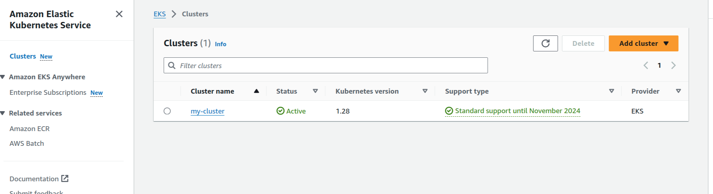
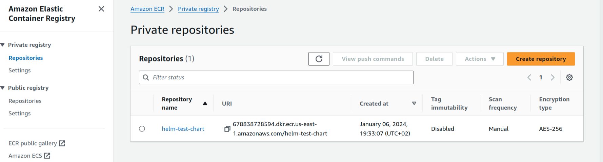
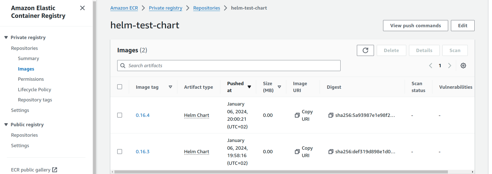

# helm-servicetemplate
Helm Service Template - tested on Python and Go apps but should work pretty much with anything.

# Usage

## Package Helm chart usage
`helm package ./service_template` and commit the new version into your remote chart repo. 

## Releases

Install a new release or upgrade:

```
helm install <release_name> <repo url> -f <path to values file>

helm upgrade <release name> <repo url> -f <path to values file>
```

You can also let helm detect if release already exists otherwise install it with 

```
helm upgrade --install <release name> ...
```
## Helm usage with AWS Services

You can keep your versions in the remote ECR repository and deploy anytime if needed required version to the EKS cluster



In general workflow should look like this:

1. First login to account

```
aws ecr get-login-password \
     --region YOUR_REGION_NAME | helm registry login \
     --username AWS \
     --password-stdin AWS_ACCOUNT_ID.dkr.ecr.us-east-1.amazonaws.com
```
2. Create repository

```
aws ecr create-repository \
     --repository-name REPO_NAME \
     --region YOUR_REGION_NAME
```
3. Push your already packaged version to the remote repo

```
helm push YOUR_CHART_FILE_VERSION  oci://AWS_ACCOUNT.dkr.ecr.us-east-1.amazonaws.com/
```




4. For deployments use 
```
helm install CHART_NAME oci://AWS_ACCOUNT_ID.dkr.ecr.us-east-1.amazonaws.com/CHART_NAME --version xx.xx.xx

```
## Useful documentation

https://docs.aws.amazon.com/AmazonECR/latest/userguide/ECR_on_EKS.html#using-helm-charts-eks

https://docs.aws.amazon.com/AmazonECR/latest/userguide/push-oci-artifact.html